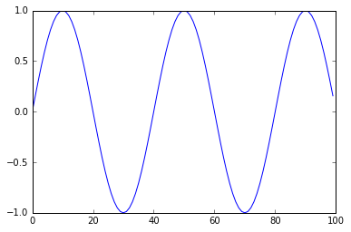

This file has been generated from the following notebook: :download:`example.ipynb`.

Download it if you want to replay it using `jupyter notebook <http://jupyter.org/>`_.

Notebook Example, Main Title
============================

Some summary

subtitle
--------

Easy to read documentation

Create variables
~~~~~~~~~~~~~~~~

.. code:: python

    from math import pi, sin

.. code:: python

    x = range(100)
    y = [sin(v * pi / 20) for v in x]

Display
-------

.. code:: python

    %matplotlib inline
    
    import matplotlib
    import matplotlib.pyplot as plt
    
    plt.plot(x,y)

.. parsed-literal::

    [<matplotlib.lines.Line2D at 0x7f04d057ad90>]

