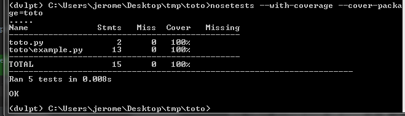

coverage
========

Add the coverage option to your test suite. It tells you exactly which parts of
your code need more thorough testing.

There is two ways to use it, either using the 'coverage' command line tool or
through the coverage option of your test suite. Both are already configured
by the system.

.. warning:: Both approaches requires the :doc:`../pysetup/main` option for nosetests
             or pytest to take the config into account. Use the `Nosetests command line`_
             approach if you don't want to add a setup.py to your package.

Modifications
-------------

.. raw:: html
    :file: modifications.html

Quick tutorial
--------------

Follow these steps to quickly install the option. I assume you already followed
:doc:`../test/main` quick tutorial::

    (dvlpt)$ pmg add coverage
    (dvlpt)$ pmg rg

Nosetests
---------

Relevant options have been written in the config file to include a coverage
report with each call to 'nosetests' or 'pytest'::

    (dvlpt)$ nosetests

will run all the tests and print a simple report as explained on coverage_report_.

.. _coverage_report: http://coverage.readthedocs.org/en/latest/cmd.html#coverage-summary

Nosetests command line
**********************

You can force nosetests to use the coverage plugin if you prefer not to use
a setup.cfg file::

    (dvlpt)$ nosetests --with-coverage --cover-package=name_of_your_package

This will produce the exact same result than the above mentioned method.

Coverage command line tool
--------------------------

Alternatively you can use 'coverage' to both run the tests, collate the results
and produce some reports::

    (dvlpt)$ coverage run setup.py test
    (dvlpt)$ coverage report

The coverage module is configured as to produce the same output than when calling
nosetests. You can also produce an html report that directly point to the incriminated
non covered statements::

    (dvlpt)$ coverage html

The result will be written in 'build/htmlcov'. Open the 'index.html' file in it
to show the report.

.. image:: coverage_html.png
