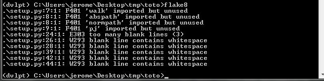

flake8
======

Test the compliance of your code with PEP8_ definitions::

    (dvlpt)$ pmg add flake8
    (dvlpt)$ pmg regenerate

Basic usage::

    (dvlpt)$ flake8

This will parse your entire package to produce a result like this one.

More advanced documentation can be found on the `flake8 website`_.

.. _PEP8: https://www.python.org/dev/peps/pep-0008/
.. _`flake8 website`: http://flake8.readthedocs.org/en/latest/index.html
