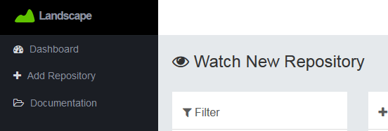
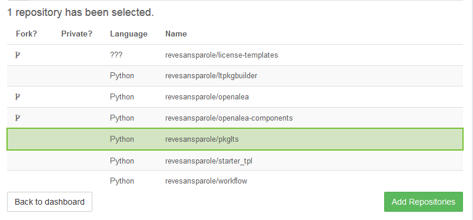
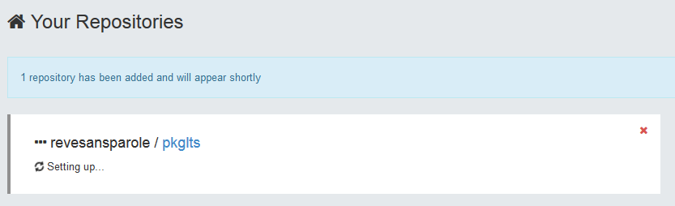
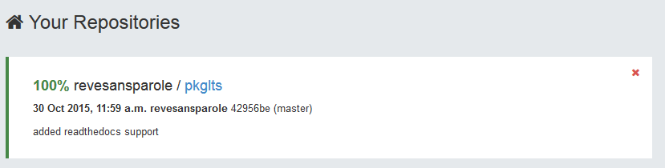

Register on Landscape.io
========================

The process of registering on Landscape_io_ is made easy since you can use your
github identity to sign up.

You must now be on the 'add project' page of landscape. If not click on the
'add repository' in the menu.

Adding your project
-------------------

Scrolling down the page you will find a list of project you are contributing.
Select yours and hit the 'add repositories' button.

Your project is added and you are redirected to the dashboard while your project
is rebuilding.

However, you still need to hit the refresh button after some time if you want to
see the result of the building process.

Final remark
------------

If everything is successful, you must now have a health-100% green badge that
show on top of your readme in the homepage of your project on github (hit refresh
if you see nothing).

Unfortunately, Landscape_io_ keep track of your compliance over time. Starting
at 100% will make it hard to improve :)

.. _Landscape_io: https://landscape.io/