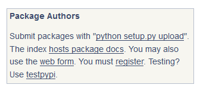
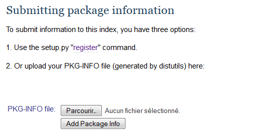
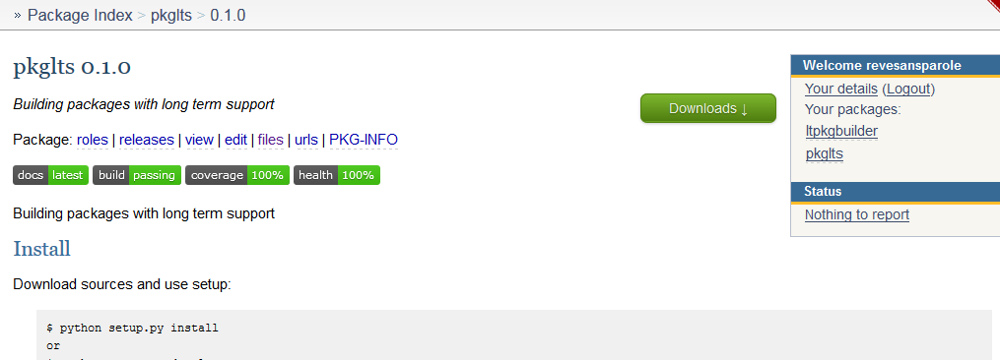

Distribute on PyPi
==================

Uploading packages on PyPi_ is an expensive operation.
So as not to pollute everybody environment just to perform some tests, in this
tutorial we are going to use the testPyPi_ repository instead of the real one.
Both behave the same so everything you do on one can be duplicated on the other
once your package is ready for production stage.

.. This tutorial follow the procedure on tuto_pypi_.
   https://pypi.python.org/pypi/twine

Register
--------

You need to setup an account on testPyPi_. Sorry, no github identification possible
and you'll have to redo this operation on the day you want to use the real
PyPI.

Once you have your credentials, if you don't want to re-enter them every time
you submit your package on pypi, you can store them in the '.pypirc' file that
was added to your package. By default, even if you leave this file at the root
of your package, it will be ignored by git. Hence no risk to store accidentally
your credentials on github.

Once you are logged in you can register your package. Go on the 'Package Authors'
section of the main page and click on the 'web form' link to register your package
manually (we know there exists some method out there to do it automatically but
let's just stick to things that work every time :)

You'll be redirected to a web page with three methods to register your package.
Choose the one you prefer. We are going to follow the second one in this tutorial.

So first we need to create a 'PKG-INFO' file. This file is generated along your
package whenever you run some packaging command so let's just create both a source
distribution and a wheel of our package::

    (dvlpt)$ python -m build

Then on the web page we can click on the 'browse' or 'Parcourir' button on the
'PKG-INFO file:' line. In the explorer that pop up, we navigate to the directory
of our package and then in "src/name_of_your_package.egg-info/" to find a 'PKG-INFO'
file without extension.

We can now click on 'Add package info' button to register our package on testPyPi_.
If everything went well you must be redirected to the homepage of your project that
display the README.rst file (must look similar to the github page then).

Upload your package
-------------------

So far your package is registered but no distribution is available for download.
Using twine_ tool, it is straightforward to upload both distributions packages
we created above::

    (dvlpt)$ twine upload dist/* -r test --config-file .pypirc

You can check at the bottom of your project page on Pypi, you must see a couple
of line with the packages ready to be downloaded.

.. image:: pypi_package_download.png

Test your distribution
----------------------

To test your distribution, simply create a new empty virtual environment and pip
install your package in it. Then try to import it in python to check that everything
went smoothly::

    $ virtualenv testenv
    $ testenv/scripts/activate
    (testenv)$ pip install name_of_your_package --extra-index-url https://testpypi.python.org/pypi

You can drop the 'extra-index-url' part if you used the regular pypi server. Now
to test::

    (testenv)$ python
    >>> from name_of_your_package import version
    >>> version.__version__
    "0.1.0"

.. _PyPi: https://pypi.python.org/pypi
.. _testPyPi: https://testpypi.python.org/pypi
.. _tuto_pypi: https://wiki.python.org/moin/TestPyPI
.. _twine: https://pypi.python.org/pypi/twine

