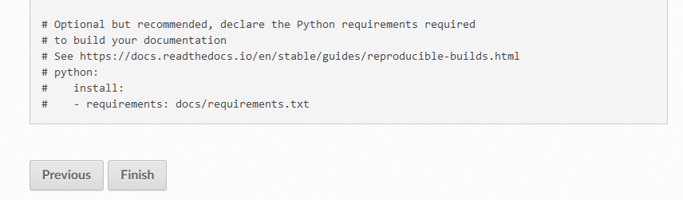

Register on ReadTheDocs
=======================

The first thing to do is to login on readthedocs_. Unfortunately you can't use
your github account this time and you have to create a couple login/password.

If your registration and login are successful you must arrive on your home page.

.. image:: readthedocs_home.png

Hitting 'import a project' leads you to a list of projects you collaborate.

.. image:: readthedocs_import.png

If nothing is showing try clicking on the refresh list button.

.. image:: readthedocs_refresh.png

Importing your project
----------------------

If you are lucky, clicking the '+' sign nearby your project name can be sufficient
to import your project. Unfortunately you will certainly have to fall back on the
'import manually' method. Clicking the eponymous button will lead you to the
registering page.

.. image:: readthedocs_manual_import.png

Fill the fields with the relevant information. 'name' can be the same name you
use for your project on github. 'repository url' corresponds to the url of the github
repository. You can copy/paste it from the 'HTTPS clone url' box on the home page
of your project on github.

.. image:: readthedocs_github_repo_url.png

Leaving default branch blank and language to english, clicking **next** will lead
you to a page explaining how to setup your project.
Since this part is managed by pkglts you can safely ignore it and click on **finish**.

Making the generation of your doc successful
--------------------------------------------

For your documentation to be build everytime you push on your original repo, you
need to follow the doc and register a webhook.

https://docs.readthedocs.io/en/stable/guides/setup/git-repo-manual.html

Final remark
------------

If everything is successful, you must now have a doc-latest green badge that
show on top of your readme in the homepage of your project on github (hit refresh
if you see nothing). This badge links to the public version of your doc.

No more excuses to postpone the writing of a comprehensive documentation for your
beautiful code :)

.. _readthedocs: https://readthedocs.org/
