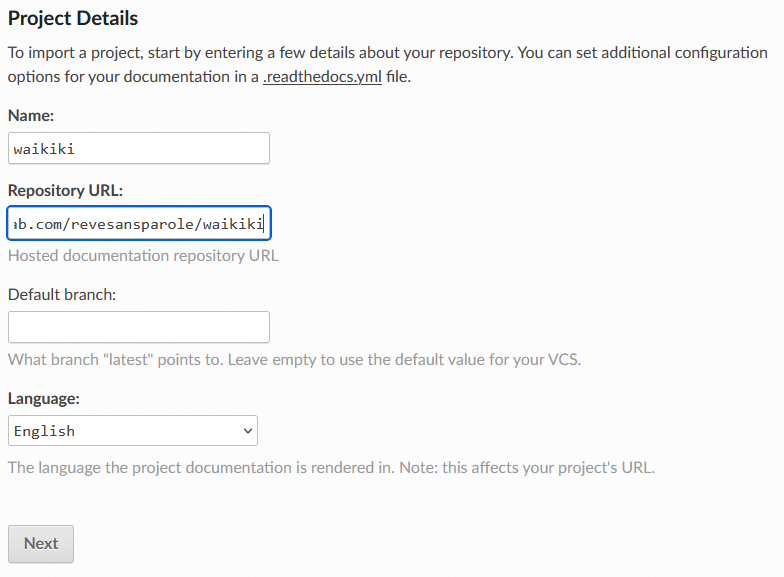

Register on ReadTheDocs
=======================

The first thing to do is to login on readthedocs_. Unfortunately you can't use
your github account this time and you have to create a couple login/password.

If your registration and login are successful you must arrive on your home page.

.. image:: readthedocs_home.png

Hitting 'import a project' leads you to a list of projects you collaborate.

.. image:: readthedocs_import.png

If nothing is showing try clicking on the refresh list button.

.. image:: readthedocs_refresh.png

Importing your project
----------------------

If you are lucky, clicking the '+' sign nearby your project name can be sufficient
to import your project. Unfortunately you will certainly have to fall back on the
'import manually' method. Clicking the eponymous button will lead you to the
registering page.

Fill the fields with the relevant information. 'name' can be the same name you
use for your project on github. 'repository url' corresponds to the url of the github
repository. You can copy/paste it from the 'HTTPS clone url' box on the home page
of your project on github.

.. image:: readthedocs_github_repo_url.png

Leave the repository type on 'git' and don't forget to check the 'edit advanced'
before you click on 'next' if you want to add more information.

Making the generation of your doc successful
--------------------------------------------

The previous step must have led you to your project home page with a sentence
reading that the build is in progress.

.. image:: readthedocs_project_page.png

Unfortunately there is a good chance that this build will fail depending on the
actual external package requirements of your project. To ensure subsequent build
to be successful, you need to activate the virtualenv option. Check the corresponding
box in the admin/advanced settings panel.

.. image:: readthedocs_admin.png

and enter 'requirements.txt' in the 'requirement file' field of the form. Don't
forget to click on the 'submit' button at the bottom of the page. You'll be
redirected to the project home page and a new build must be taking place. A successful
one this time hopefully :)

Final remark
------------

If everything is successful, you must now have a doc-latest green badge that
show on top of your readme in the homepage of your project on github (hit refresh
if you see nothing). This badge links to the public version of your doc.

No more excuses to postpone the writing of a comprehensive documentation for your
beautiful code :)

.. _readthedocs: https://readthedocs.org/
