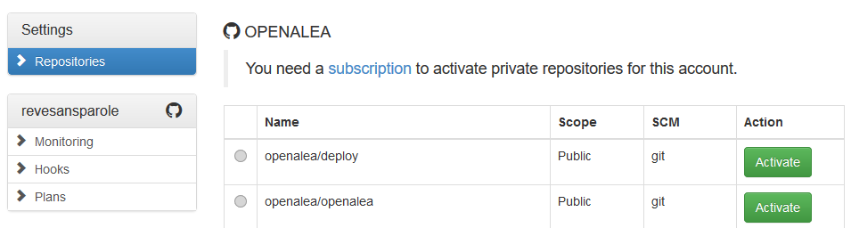
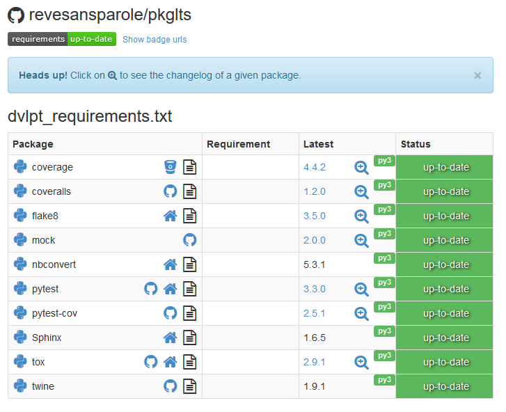

Register on requires.io
=======================

As always, you need to register on requires_io_. This process is made easy since
you can used you GitHub_ id to sign up.

You must arrive on the main page of requires_io_ with a small set of instructions
to add a repository.

Add your project
----------------

Registering a project is easy and you just need to click on the 'Activate' button.

requires_io_ use notifications from GitHub_ to gather information on your project,
so you need to trigger a new action if you want to see some result, either::

    $ git push

After requires had time to gather information, if you click the link provided
for your porject on requires_io_ you must see the statistics on your code.

Final remark
------------

If everything is successful, you must now have a requirements up-to-date green
badge that show on top of your readme in the homepage of your project on github
(hit refresh if you see nothing).

.. _requires_io: https://requires.io/
.. _GitHub: https://github.com/
