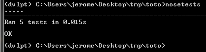

test
====

Simple testing facilities making extensive use of test frameworks to run tests. By default pytest_ is selected but this can be customized in the option of the 'test' section of the configuration file attached to the project.

For the moment only two frameworks are supported: pytest_ and nose_.

Two different ways to run the tests, either through the setuptools call to setup.py::

    (dvlpt)$ python setup.py test

or through the use of the 'pytest' or 'nosetests' command line argument::

    (dvlpt)$ pytest
    (dvlpt)$ nosetests

Have a look at nose_cmd_ for more information on the way to use nose_.

Modifications
-------------

.. raw:: html
    :file: modifications.html

Quick tutorial
--------------

Follow these steps for a quick setup (do :doc:`../base/main` quick tutorial first
if you haven't done it yet)::

    (dvlpt)$ pmg add test
    (dvlpt)$ pmg regenerate
    (dvlpt)$ pmg example test

    (dvlpt)$ nosetests

.. _nose: https://nose.readthedocs.org/en/latest/
.. _nose_cmd: http://nose.readthedocs.org/en/latest/usage.html
.. _pytest: https://docs.pytest.org/en/latest/
