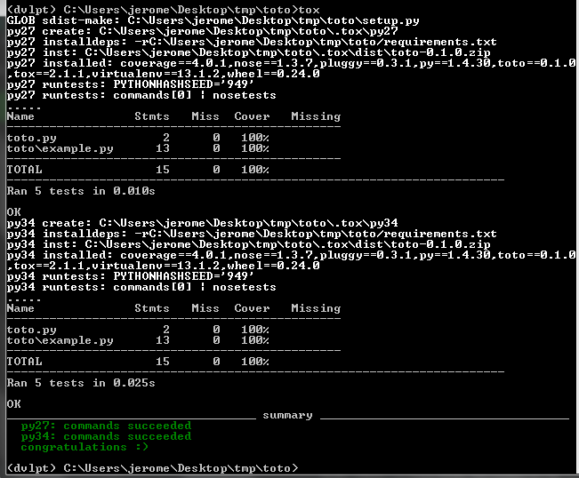

tox
===

Extend the testing of your package to other python environments. It requires that
you install other python interpreters on your computer. By default, each time you
regenerate your package it will check among all the 'intended_versions' that
you registered with the :doc:`../setup/main` option the python environments that
actually exists on your machine and create a tox.ini file with the relevant options::

    (dvlpt)$ pmg add tox
    (dvlpt)$ pmg regenerate

To invoke tox, just use the command line tool::

    (dvlpt)$ tox

To produce a result like this one.

