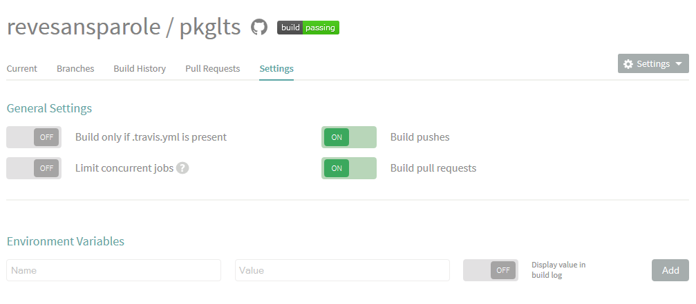
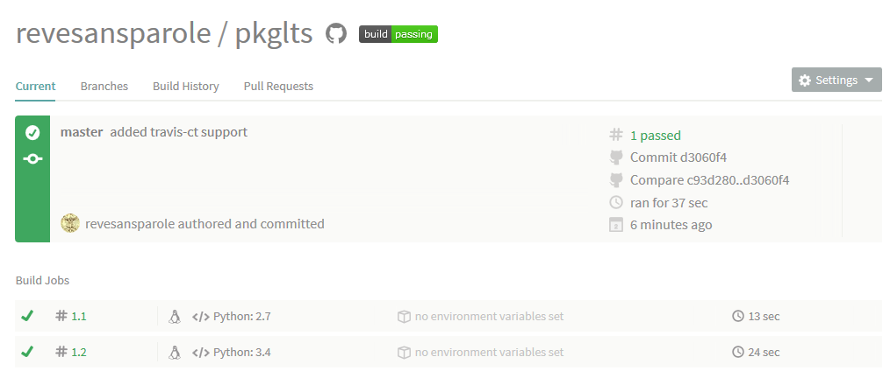

Register on Travis
==================

The first thing to do is to sign up on Travis-CI_. Luckily you can use your github
credential to sign up so no need to create a new account.

Find your project
-----------------

On your home page ('https://travis-ci.org/profile/github_login_name') you will find
all the projects you contribute. If yours is not showing try to hit the 'Sync' button.

.. image:: travis_home_page.png

The page offers a handy remainder on how to start, just follow it. Mostly just flip
the switch in front of your project. Now is the right time to add the 'travis' option
to your package if you have not done it already. It will take care of creating the
needed 'travis.yml' file::

    (dvlpt)$ pmg add travis
    (dvlpt)$ pmg regenerate

A simple git push will trigger the first automatic rebuild::

    $ git add --all
    $ git commit -m"added travis-ct support"
    $ git push

Check your build
----------------

If you click on the small gear near the name of your project you'll be redirected
to the setting page for your project.

Hopefully, you'll see the badge stating that your build is successful. If you
currently have no modules in your package, now maybe the right time to add some
examples::

    (dvlpt)$ manage example test

    $ git add --all
    $ git commit -m"added some example files"
    $ git push

Wait for a few moments that the server rebuild your project and then you will see
the build-passing badge turn green (maybe refresh your explorer). By clicking on
the name of your package near the badge you will be redirected to the report page
for your project.

Final remark
------------

If everything is successful, you must now have a build-passing green badge that
show on top of your readme in the homepage of your project on github (hit refresh
if you see nothing).

Downside is that if you now make poor code, you get the infamous red build-fail
badge showing :)

.. _Travis-CI: https://travis-ci.org/